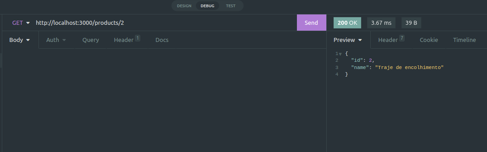
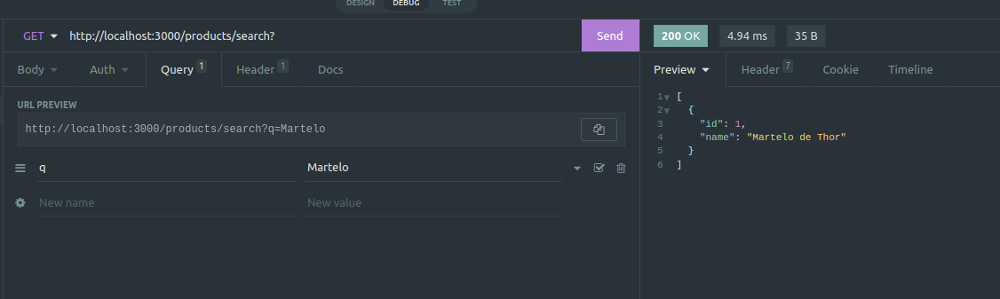
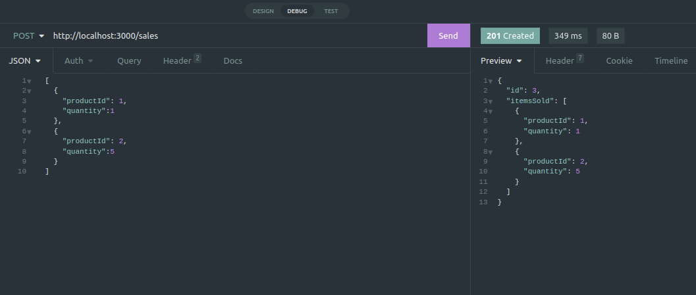
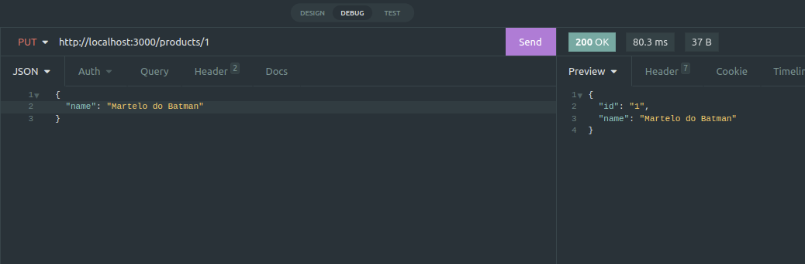
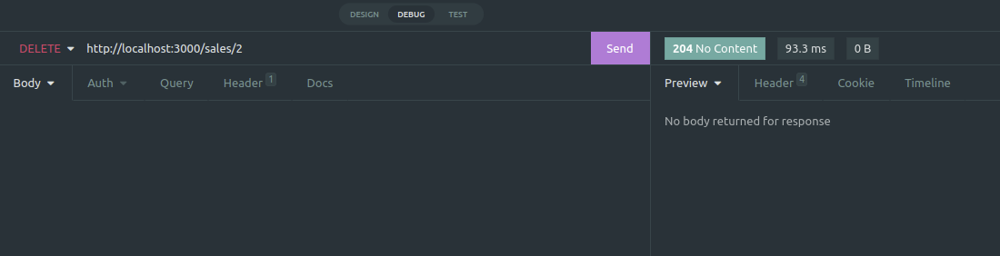
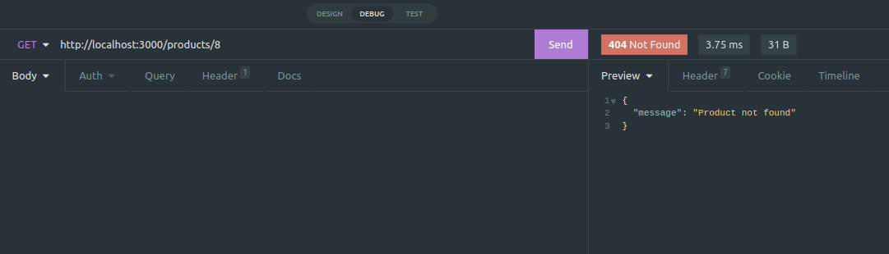

# Projeto Store Manager 

Neste repositório contém o codigo desenvolvido no projeto Store Manager durante o curso da [Trybe](https://www.betrybe.com/) no módulo de Back-end feito pelo aluno [Matheus Marinho](https://www.linkedin.com/in/matheus-marinhodsp/).

## Objetivo do Projeto
O projeto consiste na criação de uma **API RESTful** feita em Node.js utilizando a arquitetura **MSC** que tem o objetivo de manipular um banco de dados simples, o banco de dados possui as tabelas de: products, sales, e sale_products, a aplicação recebe requisições **HTTP** e manipula o banco de dados conforme as mesmas, sejam elas **GET, POST, PUT ou DELETE**, o projeto foi feito em um container docker, utilizando o arquivo **docker-compose.yml** localizado na raiz do projeto, esse arquivo docker tambem gera um container para o banco de dados, além de que sua construção foi feita utilizando o método **TDD**.


## Tecnologias Utilizadas

- **MySQL, Node.js, JavaScript, Docker, Express, Mocha.**

## Comandos

Para criar o banco de dados:
`npm run migration`

Para limpar e popular o banco de dados:
`npm run seed`

Para utilizar o docker-compose:
`docker-compose up -d`

Para iniciar o arquivo node:
```
npm start
ou
npm run debug
```

Para executar os testes feitos com o Mocha:
`npm run test:mocha`

## Funcionalidade
Para a rota de produtos:
- Buscar por todos, buscar por Id e buscar por nome(query).
- Adicionar um novo produto.
- Atualizar um produto existente.
- Deletar um produto existente.

Para a rota de vendas:
- Buscar por todas as vendas, buscar por Id da venda.
- Adicionar uma nova venda.
- Atualizar uma venda existente.
- Deletar uma venda existente.

Segue abaixo algumas imagens dos retornos de algumas das requisições que podem ser feitas na aplicação.

#### Buscar por todas as vendas.


#### Buscar por Id do produto.


#### Buscar por nome do produto.


#### Criar uma nova venda.


#### Atualizar um produto.


#### Deletar uma venda.


#### Quando um produto ou venda não é encontrado(a) no banco de dados:

